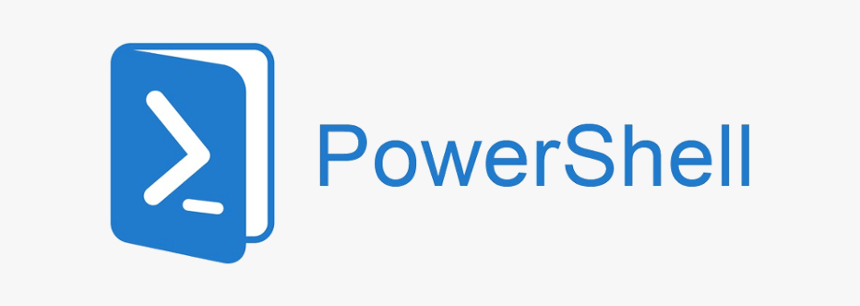

# PowerShell
My works related to PowerShell, a task-based command-line shell and scripting language designed especially for system administration.

## Table of Contents
1. [Introduction.](#introduction)
2. [Official references websites.](#references)
3. [Shell.](#shell)
4. [GitHub notes.](#github)
5. [GitHub repository calculation.](#calculation)

<a name="introduction"></a>
## 1. Introduction.
 
PowerShell is a task automation and configuration management framework from Microsoft, consisting of a command-line shell and associated scripting language. Initially a Windows component only, known as Windows PowerShell, it was made open-source and cross-platform on 18 August 2016 with the introduction of PowerShell Core. The former is built on .NET Framework while the latter on .NET Core.
<br /><br />
In PowerShell, administrative tasks are generally performed by cmdlets (pronounced command-lets), which are specialized .NET classes implementing a particular operation. These work by accessing data in different data stores, like the file system or registry, which are made available to PowerShell via providers. Third-party developers can add cmdlets and providers to PowerShell. Cmdlets may be used by scripts and scripts may be packaged into modules.
<br /><br />
PowerShell provides full access to COM and WMI, enabling administrators to perform administrative tasks on both local and remote Windows systems as well as WS-Management and CIM enabling management of remote Linux systems and network devices. PowerShell also provides a hosting API with which the PowerShell runtime can be embedded inside other applications. These applications can then use PowerShell functionality to implement certain operations, including those exposed via the graphical interface. This capability has been used by Microsoft Exchange Server 2007 to expose its management functionality as PowerShell cmdlets and providers and implement the graphical management tools as PowerShell hosts which invoke the necessary cmdlets. Other Microsoft applications including Microsoft SQL Server 2008 also expose their management interface via PowerShell cmdlets.
<br /><br />
PowerShell includes its own extensive, console-based help (similar to man pages in Unix shells) accessible via the Get-Help cmdlet. Local help contents can be retrieved from the Internet via the Update-Help cmdlet. Alternatively, help from the web can be acquired on a case-by-case basis via the -online switch to Get-Help.

<a name="references"></a>
## 2. Official references websites.
PowerShell documentation by Microsoft : https://docs.microsoft.com/en-us/powershell/ <br />
Microsoft official website : https://www.microsoft.com <br />

**_PowerShell related technologies_**
ConEmu : https://conemu.github.io/ <br />

**_PowerShell related articles_**<br />
PowerShell with Tabs Window Management by superuser : https://superuser.com/questions/863221/powershell-with-tabs-window-management

**_PowerShell developers_** <br />
Jeffrey Snover : https://github.com/jpsnover, https://twitter.com/jsnover <br />
Bruce Payette : https://github.com/BrucePay, https://twitter.com/BrucePayette <br />
James Truher : https://github.com/JamesWTruher <br />

<a name="shell"></a>
## 3. Shell.
In computing, a shell is a user interface for access to an operating system's services. In general, operating system shells use either a command-line interface (CLI) or graphical user interface (GUI), depending on a computer's role and particular operation. It is named a shell because it is the outermost layer around the operating system.

Command-line interface (CLI) shells require the user to be familiar with commands and their calling syntax, and to understand concepts about the shell-specific scripting language (for example bash).

Graphical shells place a low burden on beginning computer users, and are characterized as being easy to use. Since they also come with certain disadvantages, most GUI-enabled operating systems also provide CLI shells.
 
<a name="github"></a>
## 4. GitHub notes.
Clone the current GitHub remote repository contents into local machine.
```
$ git clone https://github.com/syakirharis25/PowerShell.git
$ cd PowerShell/
$ git remote -v
$ git status
```

<a name="calculation"></a>
## 5. GitHub repository calculation.
```
draft
```
Refer to : https://github.com/syakirharis25/cloc
